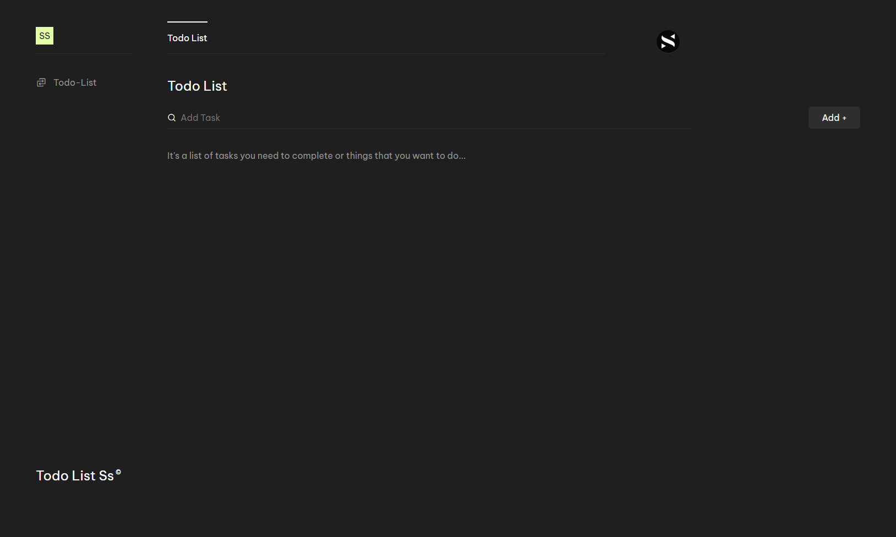

# Ss_Todo

## About

Welcome to Ss_Todo, your go-to task management application! 🚀 Stay organized, boost productivity, and accomplish your goals with ease.

## Features

- Intuitive task creation and management
- User-friendly interface for a seamless experience

## Getting Started

1. Clone the repository:

   ```bash
   git clone https://github.com/Saisudeep121521/Ss_Todo.git
   ```

2. Navigate to the project folder:

   ```bash
   cd Ss_Todo
   ```

3. Open the `index.html` file in your web browser or set up a local server.

## Screenshots



## Contributors

- [Sai sudeep](https://github.com/Saisudeep121521)

Feel free to explore the code, contribute, and boost your productivity with Ss_Todo! ✨
